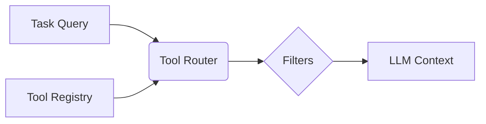

# Semantic Tool Router

[](https://github.com/arunmm8335/semantic-tool-router/actions/workflows/ci.yml)
[](LICENSE)
[](pyproject.toml)
[](CHANGELOG.md)

> **Dynamic runtime tool discovery and retrieval-augmented routing for AI agents.**

Semantic Tool Router is a dependency-light library designed to manage the "Many-Tool" problem in LLM and Agentic workflows. Instead of exposing every available tool or Model Context Protocol (MCP) server schema to a model context window (which increases costs and degrades accuracy), it embeds tools based on their descriptions and dynamically retrieves a focused candidate set ($top-k$) for the current task.

---

## When to use this

| Use Semantic Tool Router when… | Skip it when… |
| --- | --- |
| You have **20+ tools** or multiple MCP servers | You have fewer than ~10 tools — pass them all |
| Prompt **token cost** or context limits matter | You need guaranteed correctness without retrieval risk |
| You want **measurable routing** before trusting an agent | Every tool must always be visible to the model |
| You need **permission-aware** filtering (`read`, `write`, `destructive`) | Tool schemas are identical and interchangeable |

This is a **preprocessing layer** for LangChain, LlamaIndex, or custom agent loops — not another orchestration framework.

---

## How It Works



1. **Tool Indexing:** Tool descriptions, schemas, tags, examples, and permissions are compiled into search strings and vectorized.
2. **Semantic Matching:** The user query is embedded and compared against the indexed tools using cosine similarity.
3. **Metadata Filtering:** Results are filtered by permission layers (e.g. read-only vs destructive commands) or specific tags.
4. **Context Injection:** Only the top $k$ relevant tool schemas are injected into the LLM system prompt, preserving context tokens.

---

## Features

*   ⚡ **Zero-Dependency Hashing Baseline:** Comes with a local token-hashing vectorizer (`HashingEmbeddingProvider`) that runs instantly without external APIs or PyTorch downloads.
*   🔌 **First-Class MCP Client:** Connects to live Stdio MCP servers, imports schemas automatically, and executes selected tools under expectation guards.
*   🏷️ **Metadata-Aware Filtering:** Apply rigid tag filters or restrict tools based on security permissions (`read`, `write`, `execute`, `destructive`, `network`).
*   📈 **Evaluation Suite:** Measure retrieval metrics (`hit_rate@k`, `top_1_accuracy`, `MRR`, `context_tokens_saved`) against reproducible benchmark files.
*   🧠 **Swappable Embedders:** Easily swap the hashing provider for local Hugging Face `SentenceTransformers` or cloud APIs (`OpenAI`).

---

## Installation

Install the core package (includes standard hashing retriever):

```bash
pip install -e .
```

For advanced semantic embeddings, install the optional package extras:

```bash
# To run local models via SentenceTransformers
pip install -e .[sentence-transformers]

# To use OpenAI's hosted embedding models
pip install -e .[openai]
```

---

## Quick Start

### 1. Basic Tool Discovery
Query a local JSON registry of tool specs:

```bash
python -m semantic_tool_router discover "read the project README file" --registry examples/tools.json
```

Or choose a specific embedding model:

```bash
python -m semantic_tool_router discover "generate a mock logo" \
  --registry examples/tools.json \
  --embedder sentence-transformers \
  --embedding-model all-MiniLM-L6-v2
```

### 2. Live MCP Routing
Connect to a live filesystem MCP server, dynamically retrieve the top-3 candidate tools matching your task, and execute the selected tool with safety parameters:

```powershell
python -m semantic_tool_router mcp-discover \
  "read the first lines of the project README" \
  --top-k 3 \
  --allow-permission read \
  --expect-tool read_text_file \
  --call-argument "path=README.md" \
  --call-argument "head=8" \
  --server npx -y @modelcontextprotocol/server-filesystem .
```

---

## Integrations

Use the router as a preprocessing step inside standard orchestrator loops to save prompt tokens:

*   **LangChain Agent Integration:** See the [langchain_integration.py](examples/langchain_integration.py) template.
*   **LlamaIndex Agent Integration:** See the [llamaindex_integration.py](examples/llamaindex_integration.py) template.

---

## Benchmarking & Evaluation

Evaluate your router configuration on fixture datasets:

```bash
python -m semantic_tool_router benchmark \
  --registry examples/tools.json \
  --tasks benchmarks/tasks.json \
  --top-k 3
```

Compare retrievers on the frozen fixture and live MCP suites:

```bash
python -m semantic_tool_router compare-retrievers \
  --registry examples/tools.json \
  --tasks benchmarks/tasks.json \
  --suite benchmarks/live_mcp_suite.json \
  --markdown-output benchmarks/results/comparison.md
```

Use `--fixture-only` for a fast CI-friendly run without MCP servers.

Latest results: [benchmarks/results/comparison.md](benchmarks/results/comparison.md) — on live MCP tasks, hashing reaches **73% hit@3**; MiniLM reaches **87%**; cross-encoder reranking reaches **93%**.

To run the reproducible baseline benchmark suite across four official live MCP reference servers (Filesystem, Memory, Sequential Thinking, and Everything):

```bash
python -m semantic_tool_router mcp-benchmark \
  --suite benchmarks/live_mcp_suite.json \
  --workspace . \
  --markdown-output benchmarks/results/live_mcp_baseline.md
```

---

## Testing

Run unit tests locally across mock registry and MCP environments:

```bash
python -m unittest discover -s tests
```

---

## Contributing & Development

Contributions are welcome! See [CONTRIBUTING.md](CONTRIBUTING.md), [docs/benchmark-contributing.md](docs/benchmark-contributing.md), and [docs/research-plan.md](docs/research-plan.md).

1. Fork the repo and clone locally.
2. Setup tests: `python -m pip install -e .[sentence-transformers,openai]`
3. Ensure CI checks pass: `python -m unittest discover -s tests`
4. If you change retrieval behavior, run `compare-retrievers` and include before/after numbers in your PR.

---

## License

This project is licensed under the MIT License - see the [LICENSE](LICENSE) file for details.
